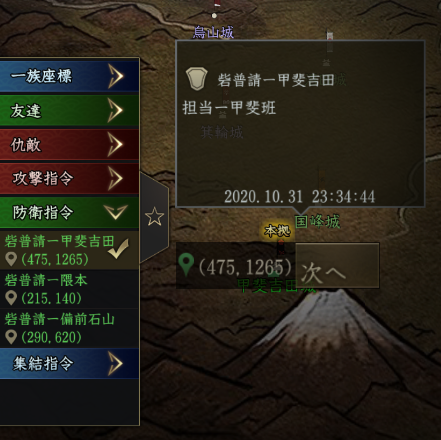
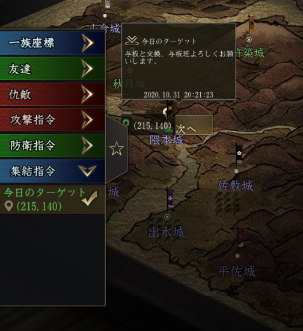
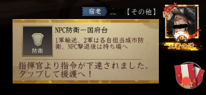
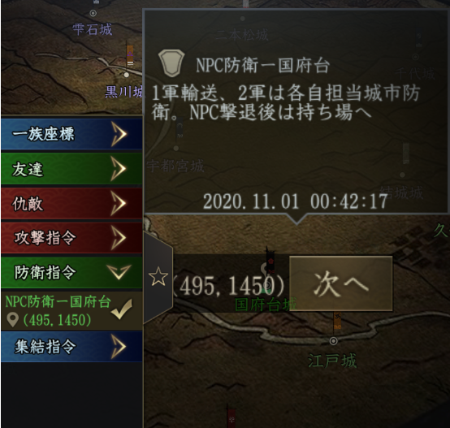
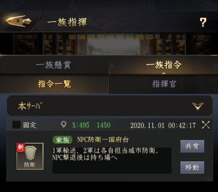

# 一族指令

2020/10/28のupdateで一族指令が実装された。  
戦争やイベント時の指示に応用できそうなので使い方をまとめる。  

一族の指揮官と同盟の指揮官がある。  
一族の当主は一族の指揮官となり、もう一人の指揮官を指定することができる。  
同盟主は一族の指揮官に加えて、同盟の指揮官となり、同盟全体の指揮官を指定することができる？（未確認）  

# 一族指令の確認

一族トップ > 一族報酬

## 指令一覧

下達された指令の一覧が表示される  
  

## 指揮官

任命された指揮官が確認できる  
  

## 指揮官は自分の指揮権を譲渡できる

指揮官の画面の「解除」を押して、譲渡する相手を選択すると次のようなメッセージが出て譲渡が可能  
  

# 指令

## 指令の下達

任意の城市、主城、砦、土地、鉱山などを選択して「指令」が出せる  
  

指令は「攻撃」「防衛」「集結」から選択する  
  

表題と備考を入力するが、チャットに表示されるのは表題のみ  
":" など、使えない文字があるので急いでいるときは要注意  
  

指令一覧にも表示される。  
  

## 同盟への指令

一族の指揮官しか任命されていない場合、同盟に指令を出そうとすると拒否される  
  

## 指令を達成したとき

実際には座標に対して指令が発動する。  
たとえば砦に対して攻撃指令を行ったとして、破壊後も指令自体は座標に残った状態になるため、手動で解除してあげる必要がある。  

# 使い道の考察

色々使えそうには見えるが、主に城時間や戦争での利用になりそう。  

## 使えないケース

指令は対象を選択したときにメニューが出るときしか使えないため、野武士や一揆、イベントのターゲットに対しては利用することができない。  
タゲ被りを防ぎたい一族武錬での利用は困難と思われる。

## 利用できそうなケース

誰がどこを担当するといった伝達ができるため、城時間には利用しやすそうな機能だ。

### ~~砦普請連絡~~

> 表題：砦　城名  
> 備考：担当　方面軍名  

~~上記のようにすると、砦普請板いらないかも。~~  

場外マップ > 左上の日本地図 > 画面左の☆をタップ

  

指令は5個が上限だった模様  

### 城攻め案内

たとえば特殊な事情があるお城の案内  
  

### NPC防衛の案内

> 表題：NPC防衛　城名  
> 備考：1軍輸送、2軍は担当城市防衛  

NPCが来るところに指令を出す  

  
 

  
 
  

