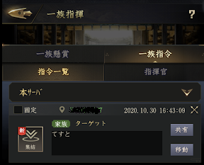
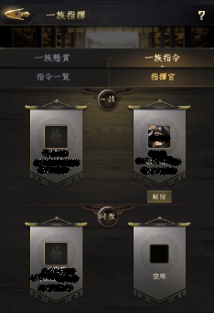
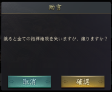
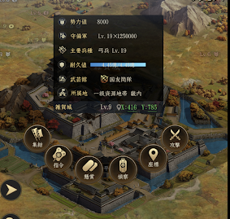
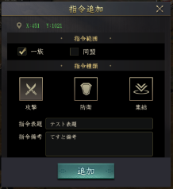
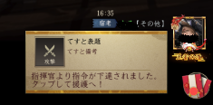
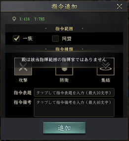

# 一族指令

2020/10/28のupdateで一族指令が実装された。  
戦争やイベント時の指示に応用できそうなので使い方をまとめる。  

一族の指揮官と同盟の指揮官がある。  
一族の当主は一族の指揮官となり、もう一人の指揮官を指定することができる。  
同盟主は一族の指揮官に加えて、同盟の指揮官となり、同盟全体の指揮官を指定することができる？（未確認）  

## 一族指令の確認

一族トップ > 一族報酬

### 指令一覧

下達された指令の一覧が表示される  
  

### 指揮官

任命された指揮官が確認できる  
  

### 指揮官は自分の指揮権を譲渡できる

指揮官の画面の「解除」を押して、譲渡する相手を選択すると次のようなメッセージが出て譲渡が可能  
  

## 指令

### 指令の下達

任意の城市、主城、砦、土地、鉱山などを選択して「指令」が出せる  
  

指令は「攻撃」「防衛」「集結」から選択する
  

表題と備考を入力するが、チャットに表示されるのは表題のみ  
":" など、使えない文字があるので急いでいるときは要注意  
  

指令一覧にも表示される。  
  

### 同盟への指令

一族の指揮官しか任命されていない場合、同盟に指令を出そうとすると拒否される  
  

### 指令を達成したとき

砦に攻撃指令を出して達成したときの動作  

解除される？されない？　　

## 使い道の考察

色々使えそうには見えるが、主に戦争での利用になりそう。  

指令は対象を選択したときにメニューが出るときしか使えないため、野武士や  
一揆、イベントのターゲットに対しては利用することができない。  

一族武錬など、ターゲット被りが多発するイベントで使いたい気持ちがあるが、  
隣の土地を選択して指令を出すなどの一工夫必要な上、倒したあとに自然に消える  
こともなく、効率的な指示だしに使うことは難しそうだ。  

