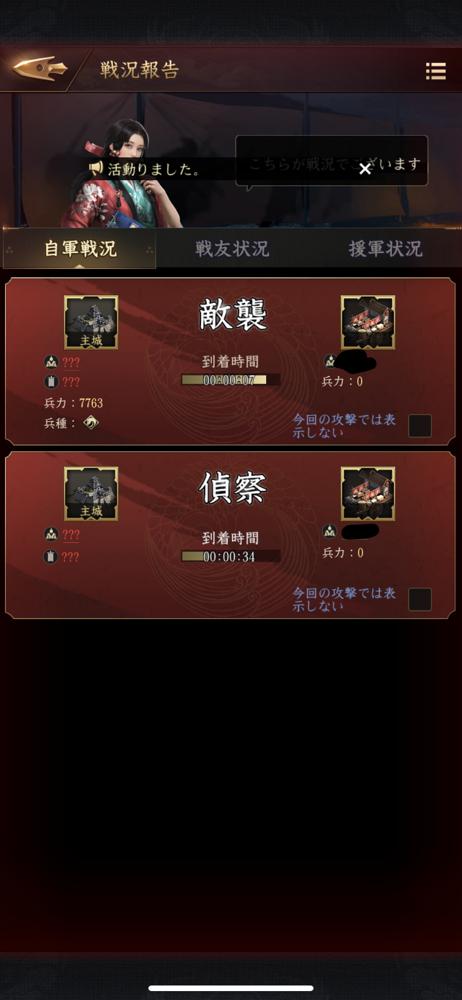

# 大名互商

## 防衛

自身が管理している市場が襲撃されても誰から攻撃を受けたかは表示されない。  
全くわからないかというとそうでもなく、偵察は線自体は出ないものの人が走っている  
様子は見えてしまうなど、注意して見られるとバレる可能性がある点に注意。  

  
襲撃を受けてもどの方角から誰が来ているか一切わからない  

  
詳細を見てもやっぱりわからない  

  
敗北しても自分の戻る線しか見えない  

  
偵察は線が出ないけど馬だけ走ってるのが見えた。  

  
一部の資源は返ってくる  
