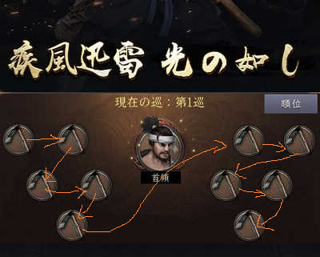
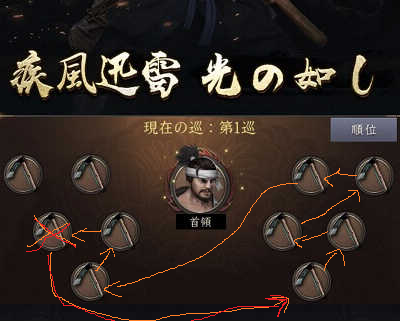

# 一族武錬

## 事前準備

* 当主の周りにイベント用の砦を普請する
* 軍役衆の箱(中箱)と、首領の箱(大箱)を決める
  * 両方とも大箱でも可
* 箱役の位置を考慮して砦を普請できると距離による不公平感を解消できる
* 箱役周辺に櫓を建てると安定感が増す
* 箱のサイズにあわせて兵士数を調整した陣形を作成しておく
* 箱役は治療する余裕もないので1000兵くらいで10個くらい陣形を作っておく

## 進め方

3つの方面軍の場合、ボスは次のように対応するのが良い。

```
ボスについて
A:1, 6, 7, 12巡目
B:2, 5, 8, 11巡目
C:3, 4, 9, 10巡目
A,B,Cの方面軍が↑のようにボス対応する
```


1. 開始直前に軍役衆箱は千軍万馬を複数使い、10集結かけられるようにする
1. イベントを開始する
1. 軍役衆箱は次のような順番で集結をかける

1. 10本集結をかける前に討伐される場合、討伐したものは次のように右下に移り詰められる

赤を討伐したときは赤矢印のように移され、オレンジ矢印のように詰められる
1. 一つでも討伐された場合、後ろから集結をかける
1. 箱役がひとりの場合は重複して集結を立てることができないため、10本集結かかるまでがんばる
