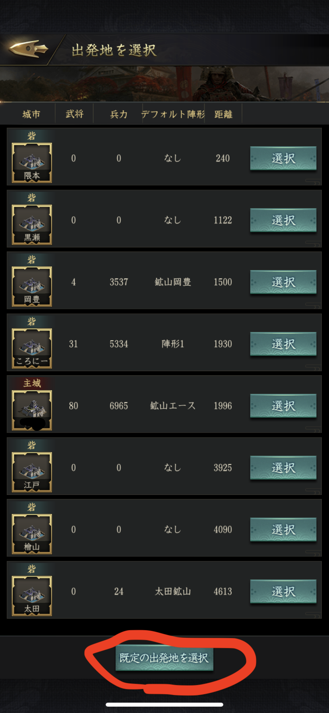
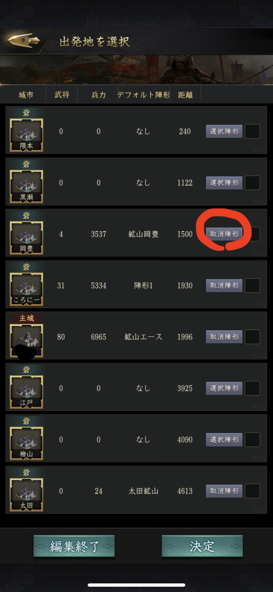
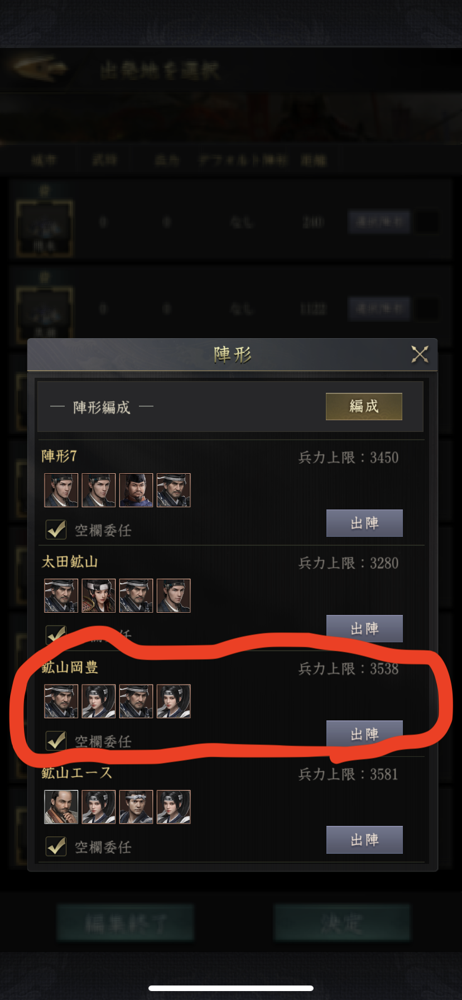
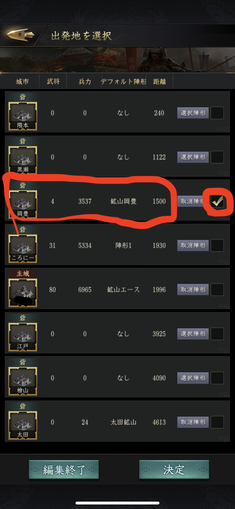
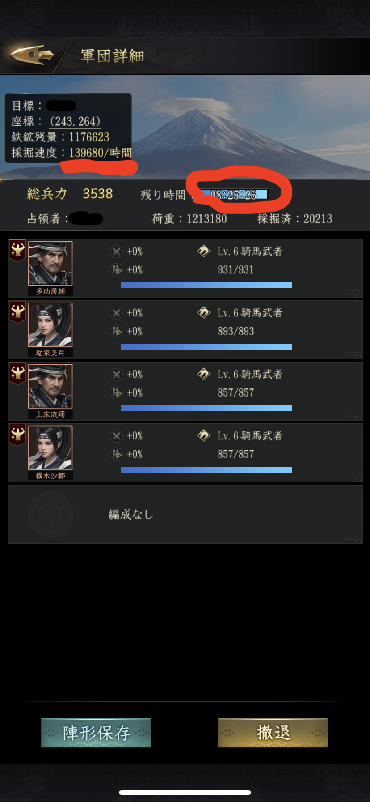

# 目次

   * [高等鉱山が取れない](#高等鉱山が取れない)
   * [野武士あれこれ](#野武士あれこれ)
   * [戦争のあれこれ](#戦争のあれこれ)
   * [一族格付け](#一族格付け)
   * [装備品](#装備品)
   * [スタートダッシュ](#スタートダッシュ)

# 高等鉱山が取れない

## メンテ明けを狙う
毎週水曜日12:00は新品鉱山が大量  
これまじおすすめ  

## デフォルト陣形を使う
### 事前準備
稽古場で鉱山隊を作っておく  
鉱山隊は統率の高い武将を主に置き、スキル持ちがいなければ他は空で良い  
鉱山隊は各砦にエリア毎に配備しておくと往復が早い  

### デフォルト陣形の設定
1. 適当な野武士や鉱山を選択して出発地の選択画面を出す  
1. 画面の下にある「規定の出発地を選択」をタップ  
  
1. チェックボックスの横にある「選択陣形」をタップ  
  
1. あらかじめ作った鉱山隊をタップ  
  
1. 鉱山隊を置いた拠点で、拠点毎の鉱山隊をデフォルト陣形として設定する  
  

あとは適当な鉱山をタップして「採掘」を選ぶと鉱山隊が選択された状態になる

## 鉱山が生まれる瞬間を狙う
鉱山が空になるとどこかに新しい鉱山が沸く。  
高等の場合はマップ全体のどこかランダムと思われる。  
広範囲に砦を散らすことにより、鉱山を掘り切った直後に新品鉱山を探すことが可能で、  
デフォルトの陣形と組み合わせると比較的容易に新品鉱山を取ることが可能。  

城市鉱山は城の周辺と決まっているため、必ず新品を発見することができる。  

## 100%安全資源の城市鉱山

普通鉱山、高等鉱山は6割が非安全資源。  
競争率が高い上に非安全資源が多い高等鉱山を狙うより、  
100%安全資源の城市鉱山を狙うという手も。  

# 野武士あれこれ

## 野武士で率兵数アップ
野武士の初回撃破は召集令と1%率兵数アップがもらえる。  
多少無理してでも野武士の限界に挑戦すると他の人より気持ち率兵数が上がる。  

兵士治療や訓練で報酬がもらえる天下布武などのイベントと合わせてやると、  
報酬もらいながら率兵数増やすなんてこともできる。  

## 資源！資源！
野武士は資源  
野武士は加速アイテムの宝庫  
野武士が落とす両金はバカにならない  

適切なレベルの野武士をこぼさず狩ることで、探宝・探訪の加速を大量に獲得可能。  
天下布武で得点報酬を全てもらうために普段から野武士を狩ってためておくのがよい。  

## 野武士で少し怪我をしてみる
ある程度レベルが上がると治療する余裕ができる。  
少し怪我するくらいの野武士を狩って、寝てる間に回復することで  
兵士100人治療の任務を済ませる。  

# 戦争のあれこれ
## 陥落はすぐに解除する
陥落関係にある場合、相手に自分の主城の座標がバレます。  
自分を守るためにも陥落関係は即時解除しましょう。  

## 捕虜はさっさと返す
捕虜をとっていると誰に捕虜を取られているか相手にバレます。  
人によっては帰還の線を辿って探すこともあるでしょう。  
自衛のためにも捕虜はさっさと解放しましょう。  

使役して得られるメリット以上にリスクがあります。  

# 一族格付け

## 一族普請はとりあえずMAX

物見櫓は5分で建つ。  
壊して作ればすぐMAX  

## 寄贈頑張る

寄贈の上限は21000、鉱山に比べるとあげやすい上に上限が大きいので、
格付けポイントを上げるために積極的に狙っていきたい。

## 野武士/城市援護は日課で稼ぐ

毎日の任務で割と簡単に稼げる

## 一揆の格付け

一揆は集結毎に格付けポイントになる。
資源の面では高レベルを狙った方が良いが、格付けの面だけでみると
Lv1/Lv2の一揆をソロで狩る方がポイントになる。

単純計算すると、
31500(一揆のポイント上限) / 15(一回の獲得ポイント) / 50(一族メンバー数) = 42  

全員がソロ一揆やるなら、一人当たり42回で完了する。  
(2日あれば余裕で終わる)

## Lv MAX狙うなら最後は鉱山

スキルなしの武将で鉱山を掘っていても、鉱山の格付けポイントはなかなか貯まらない。  
高等鉱山に入る前提で、鉱山スキルを持つ武将にスキル付き装備を持たせた場合と、スキルのない  
適当なR武将に高等掘らせた時の比較画像。  

 
 

画像では率兵数を頑張れていない中途半端な状態になっているが、鉱山部隊の主に統率高めの武将を置いて  
鎧を装備させ、スキルありの武将+スキル付き装備を先,軍に配置することで、効率の高い鉱山部隊を作る  
ことができる。  

# 装備品

## スキル付き装備
装備のスキルは武将のスキルに加えて加算される。
ステータスが高い武将に持たせる場合、装備のスキルはステータスの
プラス分より遥かに重要度は高い。

特に資源は最優先で確保するための壺のスキルは重要で、序盤は村落の銅銭収入を
上げる交易商、鉄を使うようになる頃には探測で採掘効率を上げたい。

装備品のスキルレベルはレア度の高い装備ほど高くなる。

## スキルが気に入らない時はチェンジ
商船の装備品交換で装備に付いたスキルを入れ替えることができる。
商船の装備品交換は以下の2パターンが存在する。

1. 同一ランク同士の1:1交換
1. 格下装備3:ランク上の装備1

前者はスキル付き装備を交換に出せば100%スキル付き装備が来る。
後者はスキル付き装備を出す分だけスキル付き装備が来る確率が上がり、
3個スキル装備で埋めると100%スキル付きの上位装備が手に入る。

# スタートダッシュ

## 加速をケチらない
加速アイテムは野武士,主城商店,一族商店ですぐに手に入るのでガンガン使う。
序盤は評定の主任務/副任務をきっちり終わらせて、資源を回収しながら加速する。

## 軍師の諫言：殿の審査
殿の審査でもらえる建築加速や資源は貴重
多少の両金を使うくらいは惜しまず終わらせる方が結果的にプラスになる

## 任務できっちり200両金ゲット
序盤でも一族に入っていれば、活躍度700の200両金は手に入る

### 以下はLv10未満でも狙える
- 戦策10個使用
-- 後半腐るほど手に入るので任務の分だけ使っていく
- 野武士に勝利
-- 無理ないLvを確実にこなす
- 商家街で道具購入
-- 2両金, 10両金のものをきっちり購入
- 探宝
- 探訪
- 商船での交換
-- 無理のない程度に

### 一族に入っている場合
- 一族寄贈
-- 任務の分だけでも
- 一族商店で道具購入
-- 100前後で買えるものだけ買う
- 城市攻撃＆援護
-- 何往復してでもMaxまで稼ぐ

