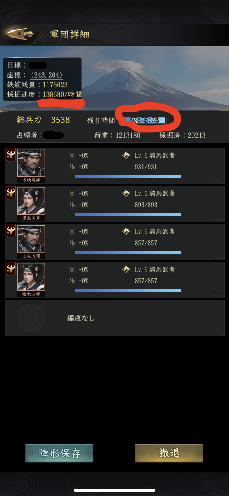
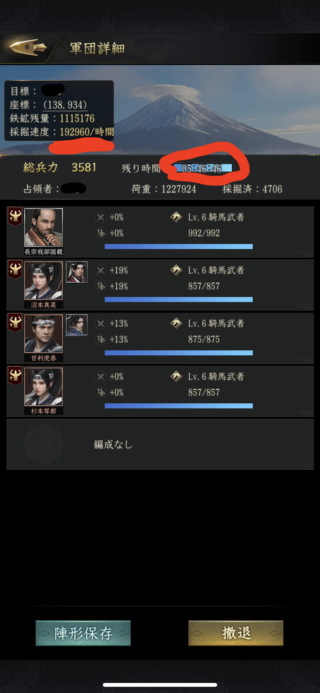
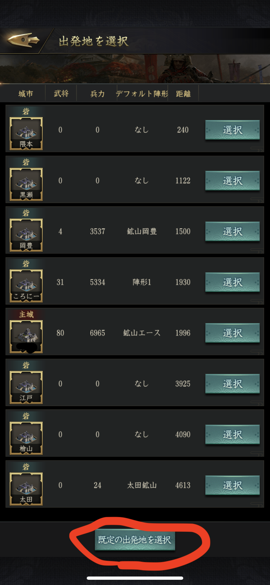
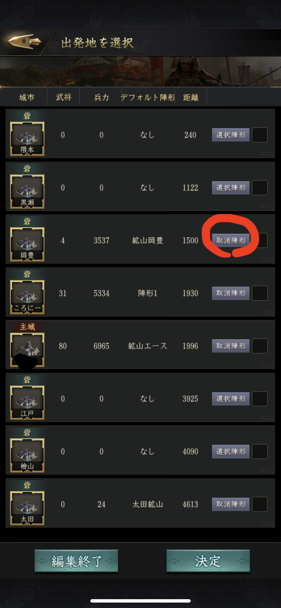
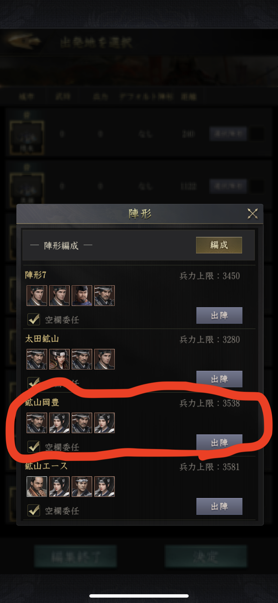
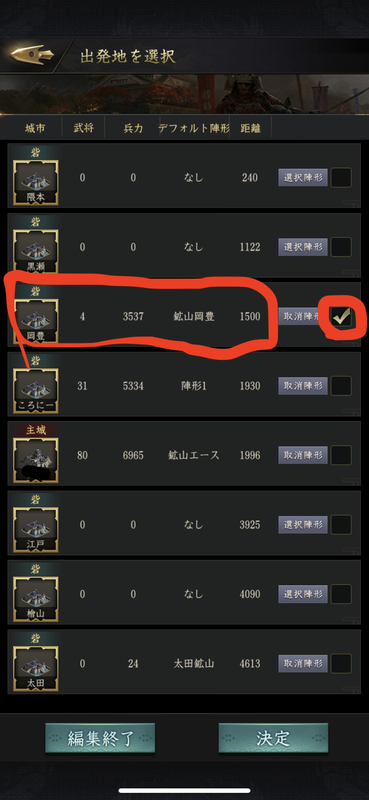

# 目次

   * [鉱山を掘る前に](#鉱山を掘る前に)
   * [高等鉱山について](#高等鉱山について)
   * [城市鉱山について](#城市鉱山について)
   * [高等鉱山と城市鉱山](#高等鉱山と城市鉱山)

# 鉱山を掘る前に

## 採掘効率を上げる

スキルなしの武将で鉱山を掘っていても採掘効率は低く、多くの鉄を獲得するのは困難。  
採掘スキルや採掘スキル付き宝物を持たせてより多くの鉄を掘れるようにしたい。  
高等鉱山に入る前提で、鉱山スキルを持つ武将にスキル付き装備を持たせた場合と、スキルのない適当なR武将に高等掘らせた時の比較画像。  

 
 

画像では率兵数を頑張れていない中途半端な状態になっているが、鉱山部隊の主に統率高めの武将を置いて鎧を装備させ、スキルありの武将+スキル付き装備を先,軍に配置することで、多くの鉄を持ち帰れる効率の高い鉱山部隊を作ることができる。  

他にも採掘研究をコツコツとやれば特殊なスキルがなくても20万/h以上の速さになる。  

## 採掘した鉄の積載量を上げる

多くの鉄を持ち帰るためには積載量を上げる必要がある。  
積載量が少ないと寝ている間や用事がある間に鉱山をなくすことになる。  

積載量を上げる方法は主に二つ
- 積載量増加スキル（宝物には無い）
- 積載量増加の秘策
- 率兵数アップ
- 兵士レベルアップ
- 学問所での研究

もっとも手っ取り早く確実なのは統率の宝物を持たせて率兵を上げることで、次に学問所での研究。  
この二つはきっちりやることをオススメしてます。  

## デフォルト陣形を使う

### 事前準備
稽古場で鉱山隊を作っておく  
鉱山隊は統率の高い武将を主に置き、スキル持ちがいなければ他は空で良い  
鉱山隊は各砦にエリア毎に配備しておくと往復が早い  

### デフォルト陣形の設定
1. 適当な野武士や鉱山を選択して出発地の選択画面を出す  
1. 画面の下にある「規定の出発地を選択」をタップ  
  
1. チェックボックスの横にある「選択陣形」をタップ  
  
1. あらかじめ作った鉱山隊をタップ  
  
1. 鉱山隊を置いた拠点で、拠点毎の鉱山隊をデフォルト陣形として設定する  
  

あとは適当な鉱山をタップして「採掘」を選ぶと鉱山隊が選択された状態になる

# 高等鉱山について

## メンテ明けを狙う
毎週水曜日12:00は新品鉱山が大量  
これまじおすすめ  

## 鉱山が生まれる瞬間を狙う
鉱山が空になるとどこかに新しい鉱山が沸く。  
高等の場合はマップ全体のどこかランダムと思われる。  
広範囲に砦を散らすことにより、鉱山を掘り切った直後に新品鉱山を探すことが可能で、  
デフォルトの陣形と組み合わせると比較的容易に新品鉱山を取ることが可能。  

# 100%安全資源の城市鉱山

普通鉱山、高等鉱山は6割が非安全資源。  
競争率が高い上に非安全資源が多い高等鉱山を狙うより100%安全資源の城市鉱山を狙うという手も。  

# 高等鉱山と城市鉱山

長い時間かけて探して、長距離を移動して掘りに行く高等鉱山と、短い移動距離でそれなりに掘れる城市鉱山の効率の分岐点について考察する。  

いつか。
